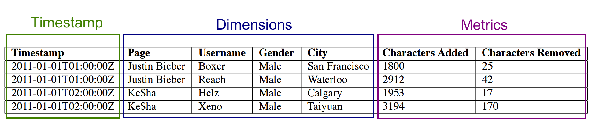
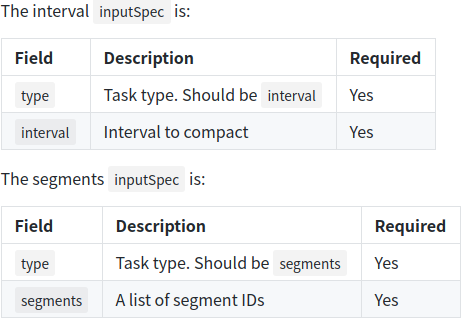

perl：https://blog.csdn.net/Hello_World_QWP/article/details/82624715

# 文档

中文文档(翻译官网的)：https://www.apache-druid.cn/GettingStarted/chapter-1.html

https://yuzhouwan.com/posts/5845/

ISO8601 时间格式：https://www.cnblogs.com/xdao/p/iso8601.html

druid 中文介绍：https://www.cnblogs.com/lqblods/p/12221496.html

数据存储结构介绍、sql 执行流程：https://mp.weixin.qq.com/s/wLhJ7qr-jZcFEQ-ECqxeDg

# 安装

1. 复制 single server deployment 下的配置，放到 cluster 下面。
2. 配置 metadata 的存储位置为 mysql。
3. 配置 deep 的存储位置为 hdfs。
4. 配置 hdfs，复制各种 *-site.xml 到 _common 目录。
5. 删除多余的 `druid.extensions.loadList`，只保留一个。
6. 配置 zookeeper。
7. 配置 `druid.host`。


使用 start-cluster-*.sh 启动，bin/service --down  关闭。

# 设计

## segment

dataSource 像表，每个 dataSource 都按照时间分区，每个时间分区都称作 chunk。

在一个 chunk 中，数据被划分为多个 segment，每个 segment 是一个文件。

- segement 构建过程：
  1. 转换成列的格式
  2. 建立位图索引。
  3. 使用各种压缩算法压缩。
     1. 字符串列的 ID 存储最小化的字典编码
     2. 位图索引的位图压缩
     3. 所有列的类型感知压缩

segment 会定期提交与发布，被写入 deep storage，变为不可变的，并从 MiddleManager 迁移到 Historical，该 segement 的元数据被写入 metedata storage，元数据包括 segment 的 schema、大小、在 deep storage 中的位置等，这些元数据使 Coordinator 了解集群上有那些数据的内容。

- 调整大小

  segment 文件应该在 300mb-700mb 内，可以通过调整 segmentGranularity、partitionsSpec 的 targetPartitionSize 控制 segment 的大小。

- 核心数据结构

  列式存储的，共有三种基本列类型：timestamp、dimension、metric。

  

  - timestamp 与 metric 是使用 LZ4 压缩的。

  - dimension 因为要支持过滤与 group-by，所以每个 dimension 需要以下三个数据结构：

    1. 将列值映射到整数的 id 的字典(一直把列值当成字符串)。
    2. 使用 1 中字典编码的列值列表。
    3. 每个列的不同的列值都有 bitmap index，它表示哪一行包含该值。

    - 为什么使用三个数据结构：

      1. 字典将字符串映射为整数，是为了可以紧凑的表示 2，3 中的值。

      2. bitmap 索引为了快速的过滤数据，特别是 and、or 操作。
      3. group by、topN 查询需要 2 中列值列表，仅基于 filter 聚合 metric 的操作不需要 2 中的列值列表。
      4. 位图索引压缩效率极高。

  - 多值列

    ？？？

- sql 兼容的 null 处理

  默认情况下，string 类型的 '' 与 null 可互换使用，数值类型的 null 会强制变成 0。

  当 `druid.generic.useDefaultValueForNull` 设置为 false 时，string 类型的 '' 与 null，数值类型的 0 与 null，互不相通，例如 name = '' 与 name is null 不相同。

  如果关闭 sql 兼容 的 null 处理，对于 string 类型来说，只是为 null 保留了额外的字典条目，但是对于数值列来说，将与一个附加位图一起存储在 segment 中，附加位图表示哪些行是 null，除了略微增加 segment 大小之外，由于需要检查 `null` 的位图，SQL兼容的空值处理在查询时也会导致性能损失，此性能开销仅对实际包含 `null` 列的场景中存在。

### segment identifier

由 dataSource name + time interval + version number(date) + partition number 确定的 segment id。

partition number 从 0 开始，但如果是 0 的话不会显示为 0，而是不带 partition number，该 chunk 的第二个 segment 是 1，以此类推。

同一 chunk 中的多个 segment 共享一个 version。

### segment lifecycle

1. deep storage：

   segment 构建完成后会发送到 deep storage。

2. metadata storage：

   然后将 segment 的元数据存储到 metadata storage 中。

   元数据中包含名为 used 的 boolean 字段，控制 该 segment 是否可查询，实时任务创建的 segment 在发布之前就可以查询，segment 完成之后会发布、并无法添加其他的数据。

3. Availability for querying：

   segment 可用于查询。

- 可以在 druid 中查看 sys.segments 表，有以下状态字段：

  - is_published：如果已经发布并且 metadata storage 中的 used 字段为 true 的话，该字段为 true。

  - is_available：如果该 segment 在 realtime task or Historical 可查询，该字段为 true。

  - is_realtime：如果 segment 仅在实时任务中可用，该字段为 true。对于实时摄取的 datasource 来说，刚开始该字段为 true，当 segment 发布并 handoff 之后变为 false。

  - is_overshadowed：如果 segment 已发布、used 字段为 true、被其他已发布的 segment 完全覆盖，该字段为 true。该状态是过渡状态，处于该状态的 segment 的 used 字段很快会被设置为 false。

### Segment Components


- segment 由以下几个文件组成：

  1. version.bin

     四个字节，以整数表示的当前 segment 版本号。

  2. meta.smoosh

     存储 smoosh 文件内容的元数据的文件，元数据为文件名和偏移量。

  3. XXXXX.smoosh

     这些文件中有一些是串联的二进制数据。

     为了减少需要打开的容纳数据文件的数量，每个 smoosh 文件最大为 2GB。

     一个 smoosh 文件中只存储一个列的数据，并在 index.drd 中提供有关该 segment 的额外元数据。

### Format of a column

每列存储为两部分：

1. jackson 序列化的 ColumnDescriptor。
2. 列二进制文件的其余部分。

ColumnDescriptor 本质上是一个对象。

### Compression

默认情况下使用 LZ4 压缩列，使用 Roaring 压缩 string 类型、数值 null 类型的位图索引。

推荐不改。

### Replacing segments

druid 批量 index task 保证了 interval 内的原子更新，当 segment 被替换时，在新版本被发布之前，只会使用旧版本的，当新版本发布后，所有查询都将忽略旧版本，不久之后旧版本将在集群中被卸载。

单个 segment 的替换是原子的，如果在一个 chunk 中有多个 segment，那对于 chunk 来说，替换不是原子的。

### index、handoff

index：创建新 segement 的机制。

handoff：发布新 segment 并交由 Historical 的机制。

发布：将 segment 元数据插入到 metadata storage 的操作。

#### index side

1. 一个 index task 开始运行，并且建立一个新的 segment。在建立之前必须先确定 segment 的 identifier。对于追加的任务(例如 kafka)，是通过在 Overlord 上调用 allocate api 潜在的在现有的 segment set 添加新分区完成的。对于覆盖的任务，是通过锁定 interval、创建新的版本号、新的 segment set 完成的。
2. 如果 index task 是实时任务(例如 kafka)，那么此时可以立即查询该 segment，segment 可用，但是没有发布。
3. index task 从 segment 中读完数据后，会将 segment 推到 deep storage 中，之后通过将 record 写到 metadate stroage 中发布 segment。
4. 如果 index task 是实时的，那么与此同时它会等待 Historical 加载 segment。如果不是，它会立即退出。

#### Coordinator / Historical side

1. Coordinator 定期轮询(默认一分钟) metadata storage，以查找新发布的 segment。
2. 当 Coordinator 发现一个已经发布并投入使用的 segment 不可用时，Coordinator 会选择一个 Historical 并指示 Historical 加载 segment 并且 serving 它。
3. 此时，如果 index task 正在等待 handoff，index task 将退出。

### Query processing

#### 流程

1. 查询首先进入 Broker，Broker 识别哪些 segment 具有与查询有关的数据。
2. Broker 确定哪些 Historicals and MiddleManagers 在为需要查询的 segment 服务，并将重写的 subquery 发送到每一个进程。
3. Historical/MiddleManager 接受查询，处理后返回结果。
4. Broker 接受从各进程返回的结果，并将它们合并在一起得到最终结果，然后返回给客户端。

#### prune

Broker 的 prune 是限制每个查询必须扫描的数据量的重要方法，但这不是唯一的方法。

每个 segment 内的索引结构使 druid 在查看任何数据之前弄清楚有哪些行与 filter set 匹配。一旦 druid 知道哪些行与查询匹配，它将仅访问该查询所需要的列。在这些列中，druid 可以在行与行之间跳过，避免读取与查询不匹配的数据。

因此，druid 使用了三种技术：

1. prune 每个查询访问的 sechema。
2. 在每个 segment 中，使用索引来标识必须访问的行。
3. 在每个 segment 中，仅读取与查询相关的行和列。

## 架构


- Master：

  它负责启动新的摄取作业并协调 Data 上数据的可用性。

  - Coordinator

    管理集群上的数据可用性，监视 Historical，将 segment 分配给特定的服务器，并确保 segment 在各个 Historical 之间保持良好的平衡。

  - Overlord

    控制数据摄取工作负载的分配，监视 MiddleManager，并且是 Druid 数据接收的控制器。它们负责将接收任务分配给 MiddleManager，并协调 segment 的发布。

- Query：

  提供与服务器的交互功能，将查询路由到 Data 或其他 Query 服务。

  - Broker

    处理外部客户端的查询。

  - Router

    可选进程，将请求路由到 Broker、Coordinator、Overlord。

- Data：

  - Historical

    储存可查询的数据，不接受写操作。

  - MiddleManager

    是执行提交了的任务的工作进程，middleManager 将 task 转发给 Peon。

    Peon：由 MiddleManagers 生成的任务执行引擎。每个 Peon 运行一个单独的 JVM，负责执行一个 task。Peon 总是和创建它们的 MiddleManager 在同一个主机上运行。

    

  - Index

    可选，是 MiddleManager 和 Peon 的替代方法。Indexer 在单个 JVM 进程中作为单个线程运行任务，而不是为每个任务创建单独的 JVM 进程，Index 更易于配置，更好的实现跨任务的资源共享。
  
    还处于试验阶段。

### 外部依赖

- deep storage

  存储 segment，作为数据的备份、druid 进程之间传输数据的媒介。

  不会直接从 deep store 中查询数据，而是从 Historical 的本地磁盘中查询。

  deep store 是 druid 弹性、容错设计的重要组成部分，即使每台服务器都重新配置了，druid 也可以通过 deep store 中重新引导，只要 druid 进程能够看到存储基础结构，并获得存储在上面的 segment，那么无论坏掉多少 druid 节点，都不会丢失数据。

  

- metadata storage

  储存例如 segement 信息、task 信息。

- zookeeper

  内部服务发现、协调、选举。

  - 通过 zk 进行的操作有：
    1. Coordinator Leader 选举
    2. Historical 的 segment 的发布协议
    3. Coordinator 和 Historical 之间的 segment 加载/删除
    4. Overlord Leader 选举
    5. Overlord 和 MiddleManager 任务管理

## 数据模型

- datasource

  类似数据库中的表。

- __time

  每个 datasource 都必须有 __time 列，用于对数据分区和排序，Druid 查询能够快速识别和检索与主时间戳列的时间范围相对应的数据。Druid 还可以将主时间戳列用于基于时间的数据管理操作，例如删除时间块、覆盖时间块和基于时间的保留规则。

- dimension

  可以在查询时从 dimension 做分组，筛选，聚合。

- metrics

  以聚合形式存储的列，启用 rollup 时，会根据时间粒度、dimension 对 metrics 做指定的聚合函数。

## 分区、排序

segment 按照 segmentGranularity 分区。

druid 会根据 __time 与 dimensionsSpec 的 dimensions 中的第一个 dimension 排序。

### 如何设置分区

chunk 中的 segment 也可以进一步分区，可以将具有相同维度值的行存储到一起，对于经常用来做过滤的维度，可以大大提高性能。

？？？

# 摄取

实时摄取，可以修改 payload，什么时候生效需要再说。

实时摄取，可以多个 datasource 消费同一个 topic 的数据，不会冲突，貌似就算 datasource 重建，也不是从头开始消费数据。

## 摄取方式

Hadoop 上的摄取任务是通过 MapReduce 在 yarn 运行的(MiddleManager 仍然监视 yarn )，其他的是 MiddleManager 运行的。

有流式摄取、批量摄取两种方式。


## schema 设计

数值列没有索引，数值列可以比字符串列更快的分组。

druid 可以快速检索与 __time 列相关的查询。

## 

### 关系模型

1. datasource 没有主键或唯一键，所以跳过这些。
2. 如果需要定期更新 dimensions/lookup 并将这些更改反映在已接收的数据中，请考虑使用 lookups。
3. 如果需要将两个大型的分布式表连接起来，则必须在将数据加载到 Druid之 前执行此操作。Druid 不支持两个数据源的查询时间连接。lookup 在这里没有帮助，因为每个 lookup 表的完整副本存储在每个 Druid 服务器上，所以对于大型表来说，它们不是一个好的选择。
4. 考虑是否启用 rollup。

## 数据管理

同一 datasource 之间的 segment 可以有不同的 schema，schema 可以随时更改。

如果一个 segment 与另一个 segment 的 sechema 不同，那么缺少的列会表现为 null。

### 压缩与重新索引

```json
{
    "type": "compact",
    "id": <task_id>,
    "dataSource": <task_datasource>,
    "ioConfig": <IO config>,
    "dimensionsSpec" <custom dimensionsSpec>,
    "metricsSpec" <custom metricsSpec>,
    "segmentGranularity": <segment granularity after compaction>,
    "tuningConfig" <parallel indexing task tuningConfig>,
    "context": <task context>
}
```


通过设置 maxRowsPerSegment 或 numShards 控制 segment 数量。



## 流式摄取

kafka index task 支持在 overlord 上配置 supervisors，supervisors 管理 kafka index task 的创建。kafka index task 使用 kafka 的分区、offset 信息读取数据，保证了 exactly once。supervisor 起监视、管理故障、协调切换的作用。

```json
{
  "type": "kafka",
  "dataSchema": {
    "dataSource": "metrics-kafka",
    "timestampSpec": {
      "column": "timestamp",
      "format": "auto"
    },
    "dimensionsSpec": {
      "dimensions": [],
      "dimensionExclusions": [
        "timestamp",
        "value"
      ]
    },
    "metricsSpec": [
      {
        "name": "count",
        "type": "count"
      },
      {
        "name": "value_sum",
        "fieldName": "value",
        "type": "doubleSum"
      },
      {
        "name": "value_min",
        "fieldName": "value",
        "type": "doubleMin"
      },
      {
        "name": "value_max",
        "fieldName": "value",
        "type": "doubleMax"
      }
    ],
    "granularitySpec": {
      "type": "uniform",
      "segmentGranularity": "HOUR",
      "queryGranularity": "NONE"
    }
  },
  "ioConfig": {
    "topic": "metrics",
    "inputFormat": {
      "type": "json"
    },
    "consumerProperties": {
      "bootstrap.servers": "localhost:9092"
    },
    "taskCount": 1,
    "replicas": 1,
    "taskDuration": "PT1H"
  },
  "tuningConfig": {
    "type": "kafka",
    "maxRowsPerSegment": 5000000
  }
}
```

### ioConfig

| 字段                                | 类型             | 描述                                                         | 是否必须          |
| ----------------------------------- | ---------------- | ------------------------------------------------------------ | ----------------- |
| `pollTimeout`                       | Long             | consumer 拉取消息记录的超时等待时间，毫秒单位                | 否（默认为100）   |
| `replicas`                          | Integer          | 副本的数量，1意味着一个单一任务（无副本）。副本任务将始终分配给不同的 worker，以提供针对流程故障的恢复能力。 | 否（默认为1）     |
| `taskCount`                         | Integer          | 一个副本集中 read task 的最大数量。 这意味着 read task 的最大的数量将是 `taskCount * replicas`，任务总数（*读取 + 发布*）是大于这个数字的。如果 `taskCount > {numKafkaPartitions}`，read task 的数量会小于 taskCount。 | 否（默认为1）     |
| `taskDuration`                      | ISO8601 Period   | index task 多久 publish 一次 segment。                       | 否（默认为PT1H）  |
| `startDelay`                        | ISO8601 Period   | supervisor 开始管理任务之前的等待时间                        | 否（默认为PT5S）  |
| `useEarliestOffset`                 | Boolean          | 如果 supervisor 是第一次管理数据源，它将从 Kafka 获得一组起始偏移。此标志确定它是检索 Kafka 中的最早偏移量还是最新偏移量。在正常情况下，后续任务将从先前段结束的位置开始，因此此标志将仅在首次运行时使用。 | 否（默认false）   |
| `completionTimeout`                 | ISO8601 Period   | task publish segment 的超时时间。                            | 否（默认为PT30M） |
| `lateMessageRejectionStartDateTime` | ISO8601 DateTime | 用来配置一个时间，当消息时间戳早于此日期的时候，消息被拒绝。 例如，如果该值设置为 2016-01-01T11:00Z，supervisor 在 2016-01-01T12:00Z 创建了一个任务，时间戳早于 2016-01-01T11:00Z 的消息将会被丢弃。 | 否（默认为none）  |
| `lateMessageRejectionPeriod`        | ISO8601 Period   | 用来配置一个时间周期，当消息时间戳早于此周期的时候，消息被拒绝。例如，如果该值设置为 PT1H， supervisor 在 2016-01-01T12:00Z 创建了一个任务，则时间戳早于 2016-01-01T11:00Z 的消息将被丢弃。请特别注意，lateMessageRejectionPeriod 和 lateMessageRejectionStartDateTime 仅一个可以被指定。 | 否（默认none）    |
| `earlyMessageRejectionPeriod`       | ISO8601 Period   | 配置任务以在任务达到其 taskDuration 之后的此时间段之后拒绝带有时间戳的消息；例如，如果它被设置为 PT1H、taskDuration 设置为 PT1H 、 supervisor 在 2016-01-01T12：00Z 创建任务，消息的时间戳晚于 2016-01-01T14：00Z 的话将被丢弃。注意：例如，在 supervisor 故障转移的情况下，任务有时会超过任务持续时间。将 earlyMessageRejectionPeriod 设置得太低可能会导致每当任务运行超过其配置的 taskDuration 时，消息就会意外丢弃。 | 否（默认none）    |

index task 有两种状态，reading 与 publishing。当 index task 到达了 taskDuration，就开始 publish segment，index task 将保持 publishing 状态，直到 segment publish 完成，或者到达 completionTimeout。

reading task 的数量受 replicas 和 taskCount 控制，一般有 `replicas * taskCount` 个 reading task。taskCount 最多有 topicParitions 个。为了使 reading 与 publishing 同时进行，`workerCapacity = 2 * replicas * taskCount`。

### tuningConfig

| 字段                               | 类型           | 描述                                                         | 是否必须                                                     |
| ---------------------------------- | -------------- | ------------------------------------------------------------ | ------------------------------------------------------------ |
| `maxRowsInMemory`                  | Integer        | 在持久化之前在内存中聚合的数据的最大行数。该数值为聚合之后的行数。通常用来管理所需的 JVM 堆内存。index task 的最大堆内存是 `maxRowsInMemory * (2 + maxPendingPersists)`。通常用户不需要设置这个值。 | 否（默认为 1000000）                                         |
| `maxBytesInMemory`                 | Long           | 在持久化之前在内存中聚合的最大字节数。                       | 否（默认为 JVM最大内存 的 1/6）                              |
| `maxRowsPerSegment`                | Integer        | 聚合到一个 segment 中的行数，该数值为 roll up 后的数值。 当 `maxRowsPerSegment` 或者 `maxTotalRows` 有一个值命中的时候，则触发 handoff，该动作也会按照 `intermediateHandoffPeriod` 时间间隔触发。 | 否（默认为5000000）                                          |
| `maxTotalRows`                     | Long           | 所有 segment 的聚合后的行数，该值为聚合后的行数。            | 否（默认为unlimited）                                        |
| `intermediateHandoffPeriod`        | ISO8601 Period | 触发持续化的周期                                             | 否（默认为 PT10M）                                           |
| `maxPendingPersists`               | Integer        |                                                              | 否（默认为0，意味着一个持久化可以与摄取同时运行，而没有一个可以排队） |
| `indexSpec`                        | Object         | 如何索引数据。                                               | 否                                                           |
| `indexSpecForIntermediatePersists` |                | 定义要在索引时用于中间持久化临时 segment 的 segment 存储格式选项。这可用于禁用中间 segment 上的维度/度量压缩，以减少最终合并所需的内存。但是，在中间 segment 上禁用压缩可能会增加页缓存的使用，而在它们被合并到发布的最终 segment 之前使用它们。 | 否（默认与 `indexSpec` 相同）                                |
| `reportParseExceptions`            | Boolean        | *已废弃*。如果为true，则在解析期间遇到的异常即停止摄取；如果为false，则将跳过不可解析的行和字段。将 `reportParseExceptions` 设置为 `true` 将覆盖`maxParseExceptions` 和 `maxSavedParseExceptions` 的现有配置，将`maxParseExceptions` 设置为 `0` 并将 `maxSavedParseExceptions` 限制为不超过1。 | 否（默认为false）                                            |
| `handoffConditionTimeout`          | Long           | segment handoff 可以等待的毫秒数（超时时间）。 该值要被设置为大于 0 的数，设置为 0 意味着将会一直等待不超时 | 否（默认为0）                                                |
| `resetOffsetAutomatically`         | Boolean        | 控制当 Druid 需要读取 Kafka 中不可用的消息时的行为，比如当发生了 `OffsetOutOfRangeException` 异常时。 如果为 false，则异常将抛出，这将导致任务失败并停止接收。如果发生这种情况，则需要手动干预来纠正这种情况；如果为 true，Druid 将根据 `useEarliestOffset` 属性的值（`true` 为 `earliest`，`false` 为 `latest`）自动重置为 Kafka 中可用的较早或最新偏移量。请注意，这可能导致数据在您不知情的情况下被丢弃或重复。消息将被记录下来，以标识已发生重置，但摄取将继续。这种模式对于非生产环境非常有用，因为它使 Druid 尝试自动从问题中恢复，即使这些问题会导致数据被安静删除或重复。 该特性与Kafka的 `auto.offset.reset` 消费者属性很相似 | 否（默认为false）                                            |
| `workerThreads`                    | Integer        | supervisor 用于异步操作的线程数。                            | 否（默认为: min(10, taskCount)）                             |
| `chatThreads`                      | Integer        | 与 index task 的会话线程数                                   | 否（默认为：min(10, taskCount * replicas)）                  |
| `chatRetries`                      | Integer        | 在任务没有响应之前，将重试对 index task 的 HTTP 请求的次数   | 否（默认为8）                                                |
| `httpTimeout`                      | ISO8601 Period | index task 的 HTTP 响应超时                                  | 否（默认为PT10S）                                            |
| `shutdownTimeout`                  | ISO8601 Period | supervisor 尝试优雅的停掉一个任务的超时时间                  | 否（默认为：PT80S）                                          |
| `offsetFetchPeriod`                | ISO8601 Period | supervisor 查询 Kafka 和 index task 以获取当前偏移和计算滞后的频率 | 否（默认为PT30S，最小为PT5S）                                |
| `segmentWriteOutMediumFactory`     | Object         | 创建 segment 时要使用的写入介质。                            | 否（默认不指定，使用来源于 druid.peon.defaultSegmentWriteOutMediumFactory.type 的值） |
| `intermediateHandoffPeriod`        | ISO8601 Period | segment handoff 的频率。                                     | 否（默认为：P2147483647D）                                   |
| `logParseExceptions`               | Boolean        | 如果为 true，则在发生解析异常时记录错误消息，其中包含有关发生错误的行的信息。 | 否（默认为false）                                            |
| `maxParseExceptions`               | Integer        | 任务停止接收之前可发生的最大 ParseExceptions 数。如果设置了 `reportParseExceptions`，则该值会被重写。 | 否（默认为unlimited）                                        |
| `maxSavedParseExceptions`          | Integer        | 当出现解析异常时，Druid 可以跟踪最新的解析异常。"maxSavedParseExceptions" 决定将保存多少个异常实例。这些保存的异常将在 [任务完成报告](https://www.apache-druid.cn/DataIngestion/taskrefer.html#任务报告) 中的任务完成后可用。如果设置了`reportParseExceptions`，则该值会被重写。 | 否（默认为0）                                                |

### supervisor

#### 状态

有两个，state 与 detailedState，detailedState 更具体。

两个状态的对应关系：


#### 生命周期

1. 从 Kafka 获取分区列表并确定每个分区的起始偏移量（如果旧的 datasource，则基于最后处理的偏移量，如果这是一个新 topic，则从流的开始或结束开始）。
2. 发现正在写入当前数据源的 index task，如果这些任务与 supervisor 的配置匹配，则采用这些任务，否则发出停止的信号。
3. 向每个受监视的任务发送状态请求，更新任务的状态。
4. 处理已超过 `taskDuration` 且应从读取状态转换为发布状态的任务。
5. 处理已完成发布的任务，并发出停止冗余副本任务的信号。
6. 处理失败的任务并清理 supervisor 的内部状态。
7. 将正常任务列表与请求的 `taskCount` 和 `replicas` 进行比较，并根据需要创建其他 task。

#### 更新 spec

- 过程：
  1. 正在运行的 supervisor 对其管理的任务发出停止读取并开始发布的信号。
  2. 正在运行的 supervisor 退出。
  3. 使用新的配置创建新的 supervisor。该 supervisor 将保留现有的发布任务，并将从发布任务结束时的 offset 开始创建新 task

web 上就可以更新 spec，可以实现 schema 的无缝迁移。

#### 持久化

supervisor spec 保存在 metadata storage 中，overlord 启动的时候去 metadata storage 中读取 spec，根据 spec 创建 supervisor。

如果 supervisor 被终止，会在 metadata storage 中标记，overlord 不会加载已终止的 supervisor spec。

supervisor 终止时会让其管理的 task 的行为由 reading 变为 publishing。

## 批量摄取

druid 提交 mr 任务完成对 hdfs 上数据的摄取，支持所有 hadoop 文件格式。

```json
{
  "type" : "index_hadoop",
  "spec" : {
    "dataSchema" : {
      "dataSource" : "wikipedia",
      "parser" : {
        "type" : "hadoopyString",
        "parseSpec" : {
          "format" : "json",
          "timestampSpec" : {
            "column" : "timestamp",
            "format" : "auto"
          },
          "dimensionsSpec" : {
            "dimensions": ["page","language","user","unpatrolled","newPage","robot","anonymous","namespace","continent","country","region","city"],
            "dimensionExclusions" : [],
            "spatialDimensions" : []
          }
        }
      },
      "metricsSpec" : [
        {
          "type" : "count",
          "name" : "count"
        },
        {
          "type" : "doubleSum",
          "name" : "added",
          "fieldName" : "added"
        },
        {
          "type" : "doubleSum",
          "name" : "deleted",
          "fieldName" : "deleted"
        },
        {
          "type" : "doubleSum",
          "name" : "delta",
          "fieldName" : "delta"
        }
      ],
      "granularitySpec" : {
        "type" : "uniform",
        "segmentGranularity" : "DAY",
        "queryGranularity" : "NONE",
        "intervals" : [ "2013-08-31/2013-09-01" ]
      }
    },
    "ioConfig" : {
      "type" : "hadoop",
      "inputSpec" : {
        "type" : "static",
        "paths" : "/MyDirectory/example/wikipedia_data.json"
      }
    },
    "tuningConfig" : {
      "type": "hadoop"
    }
  },
  "hadoopDependencyCoordinates": <my_hadoop_version>
}
```

| 属性                          | 描述                                                         | 是否必须 |
| ----------------------------- | ------------------------------------------------------------ | -------- |
| `hadoopDependencyCoordinates` | Druid 使用的 Hadoop 依赖。 如果该值被指定，Druid将在 `druid.extensions.hadoopDependenciesDir` 目录下查找 Hadoop 依赖 | 否       |
| `classpathPrefix`             | 为 Peon 进程准备的类路径。                                   | 否       |

### ioConfig


# 查询

## 缓存

### Query caching

druid 支持两种级别的 cache：segment level 缓存、whole-query result level 的缓存。

如果是实时摄取任务，druid 会缓存 historical segments，重新计算实时 segment 的结果。这种情况下 whole-query result level 缓存没啥用，因为结果会不断失效。

segment level 缓存需要 druid 在每次查询的时候合并每个 segment 缓存的结果。

### Using and populating cache

use 跟 populate 是两个参数，所有的 cache 都有这两个参数，这两个参数控制着每个查询与 cache 的交互行为。

use 控制着是否使用 cache，populate 控制 query 是否更新 cache。

设置这两个参数的目的是使罕见数据的查询不会污染其他查询的 cache，例如大型报表、非常旧的数据。

可以通过在请求时以 json 格式的 context 对象设置该参数。

```json
{
  "query": "select CURRENT_TIMESTAMP",
  "context": {
    "useCache": false
  }
}
```

jdbc 可以通过 `Connection connection = DriverManager.getConnection(url, connectionProperties)` 中的 connectionProperties 设置参数。

### Query caching on Brokers

broker 支持两种级别的 cache。Segment-level caching is controlled by the parameters `useCache` and `populateCache`。Whole-query result level caching is controlled by the parameters `useResultLevelCache` and `populateResultLevelCache` and runtime properties `druid.broker.cache.*`。

druid.broker.cache.populateCache

对于小于 5 台的集群上，在 broker 上启用 segment level 缓存比在 historicals 上启用要更快的返回查询结果。

因为结果从每个 segment 返回，historicals 无法做本地合并，而 broker 可以，因为所有的数据都是到达 broker 之后返回给客户端。

### Query caching on Historicals

仅支持 segment level cache。controlled by the query context parameters `useCache` and `populateCache` and runtime properties `druid.historical.cache.*`。

大的集群应该在 historicals 上启用 segment level cache populate。

因为大集群上，historicals 可以在本地做 result merge，然后将较少的 result 返回给 broker。

### Query caching on Ingestion Tasks

Ingestion Tasks：peon、indexer

仅支持 segment level cache。controlled by the query context parameters `useCache` and `populateCache` and runtime properties `druid.realtime.cache.*`。

大集群应该在 ingestion task 上启用 segment level cache，理由同 Query caching on Historicals。


### context param

中文：https://www.apache-druid.cn/Querying/query-context.html

官网：https://druid.apache.org/docs/0.19.0/querying/query-context.html

useCache、populateCache、useResultLevelCache、populateResultLevelCache

## lookup

映射，将 dimension 的列值映射到 lookup 中的新值，比如可以将 id 映射到人名。

lookup 通常预加载到内存中。

```sql
select lookup(id,'lookup1') name from hadoop_datasource;

--lookup1 是 lookup name
```

### 更新

通过 /druid/coordinator/v1/lookups/config/__default/lookup_mysql 发送 post 请求。

更新不是立马生效，需要等一会。

### mysql

可以将本地文件、jdbc 设置成 lookup，需要安装扩展，http://druid.apache.org/docs/latest/development/extensions-core/lookups-cached-global.html。

1. 在 conf/druid/cluster/_common/common.runtime.properties 文件中的 druid.extensions.loadList 添加 druid-lookups-cached-global。
2. 官网说是将 mysql 驱动包放到 extensions/druid-lookups-cached-global 下，但是不好使，我放到 lib 下就好使了。

```json
{
  "type":"jdbc",
  "namespace":"some_lookup", //不知道有啥用，我随便设置了一个
  "connectorConfig":{
    "createTables":true,
    "connectURI":"jdbc:mysql://localhost:3306/druid",
    "user":"druid",
    "password":"diurd"
  },
  "table":"some_lookup_table",
  "keyColumn":"the_old_dim_value",
  "valueColumn":"the_new_dim_value",
  "tsColumn":"timestamp_column",  //一般是时间列，如果设置了该值，可以做到增量更新，否则是全表拉取
  "pollPeriod":600000 //轮询mysql的频率，莫认为0，只拉取一次
}
```

# 配置

通过 jvm.config 配置 jvm 参数。

## data server

### middleManager

#### peons

```properties
#Maximum number of tasks the MiddleManager can accept.
druid.worker.capacity
#default Number of CPUs on the machine - 1

#peons 的 jvm 配置
druid.indexer.runner.javaOptsArray
#例如 ["-XX:OnOutOfMemoryError=kill -9 %p"]
#default []

#peons 的 classpath
druid.indexer.runner.classpath
#default System.getProperty("java.class.path")

#可用于并行处理 Segment 的线程数,推荐是 core - 1
druid.processing.numThreads

#dimension value 的 lookup cache，启用之后可以提供聚合的速度，但会带来 gc
druid.processing.columnCache.sizeBytes
#default 0
```


# 使用

需要时间戳列

Druid的体系结构需要一个主时间戳列（内部存储在名为的列中`__time`）。如果您的数据中没有时间戳，请选择 Constant value。

```json
//"type" : "index_parallel" 是 native batch ingestion task，可以读本地的文件
{
  "type": "kafka",
  "spec": {
    "dataSchema": {
      "dataSource": "roll_up",
      "timestampSpec": { //__time 对应的列名
        "column": "time",
        "format": "auto",
        "missingValue": null
      },
      "dimensionsSpec": {
        "dimensions": [ //哪些字段是维度
          {
            "type": "string",
            "name": "id",
            "multiValueHandling": "SORTED_ARRAY",
            "createBitmapIndex": true
          }
        ],
        "dimensionExclusions": [ //哪些字段不是维度
          "count",
          "sum_value",
          "time",
          "value"
        ]
      },
      "metricsSpec": [//有哪些metric
        {
          "type": "count",
          "name": "count"
        },
        {
          "type": "longSum",
          "name": "sum_value",
          "fieldName": "value",
          "expression": null
        }
      ],
      "granularitySpec": {//粒度
        "type": "uniform",
        "segmentGranularity": "HOUR",
        "queryGranularity": "SECOND",
        "rollup": true,
        "intervals": null
      },
      "transformSpec": {
        "filter": null,
        "transforms": []
      }
    },
    "ioConfig": {
      "topic": "roll_up",
      "inputFormat": {
        "type": "json",
        "flattenSpec": {
          "useFieldDiscovery": true,
          "fields": []
        },
        "featureSpec": {}
      },
      "replicas": 1,
      "taskCount": 1,
      "taskDuration": "PT3600S",
      "consumerProperties": {
        "bootstrap.servers": "node01:9092,node03:9092,node03:9092"
      },
      "pollTimeout": 100,
      "startDelay": "PT5S",
      "period": "PT30S",
      "useEarliestOffset": true,
      "completionTimeout": "PT1800S",
      "lateMessageRejectionPeriod": null,
      "earlyMessageRejectionPeriod": null,
      "lateMessageRejectionStartDateTime": null,
      "stream": "roll_up",
      "useEarliestSequenceNumber": true
    },
    "tuningConfig": {
      "type": "kafka",
      "maxRowsInMemory": 1000000,
      "maxBytesInMemory": 0,
      "maxRowsPerSegment": 5000000, //每个Segment最多能有多少行，不推荐设置的很小
      "maxTotalRows": null,
      "intermediatePersistPeriod": "PT10M",
      "basePersistDirectory": "/servers/apache-druid-0.19.0/var/tmp/druid-realtime-persist7889349706524027451",
      "maxPendingPersists": 0,
      "indexSpec": {
        "bitmap": {
          "type": "roaring",
          "compressRunOnSerialization": true
        },
        "dimensionCompression": "lz4",
        "metricCompression": "lz4",
        "longEncoding": "longs",
        "segmentLoader": null
      },
      "indexSpecForIntermediatePersists": {
        "bitmap": {
          "type": "roaring",
          "compressRunOnSerialization": true
        },
        "dimensionCompression": "lz4",
        "metricCompression": "lz4",
        "longEncoding": "longs",
        "segmentLoader": null
      },
      "buildV9Directly": true,
      "reportParseExceptions": false,
      "handoffConditionTimeout": 0,
      "resetOffsetAutomatically": false,
      "segmentWriteOutMediumFactory": null,
      "workerThreads": null,
      "chatThreads": null,
      "chatRetries": 8,
      "httpTimeout": "PT10S",
      "shutdownTimeout": "PT80S",
      "offsetFetchPeriod": "PT30S",
      "intermediateHandoffPeriod": "P2147483647D",
      "logParseExceptions": false,
      "maxParseExceptions": 2147483647,
      "maxSavedParseExceptions": 0,
      "skipSequenceNumberAvailabilityCheck": false,
      "repartitionTransitionDuration": "PT120S"
    }
  },
  "dataSchema": {
    "dataSource": "roll_up",
    "timestampSpec": {
      "column": "time",
      "format": "auto",
      "missingValue": null
    },
    "dimensionsSpec": {
      "dimensions": [
        {
          "type": "string",
          "name": "id",
          "multiValueHandling": "SORTED_ARRAY",
          "createBitmapIndex": true //会加速 相等 和 前缀查询，仅支持 string 类型
        }
      ],
      "dimensionExclusions": [
        "count",
        "sum_value",
        "time",
        "value"
      ]
    },
    "metricsSpec": [
      {
        "type": "count",
        "name": "count"
      },
      {
        "type": "longSum",
        "name": "sum_value",
        "fieldName": "value",
        "expression": null
      }
    ],
    "granularitySpec": {
      "type": "uniform",
      "segmentGranularity": "HOUR",
      "queryGranularity": "SECOND",
      "rollup": true,
      "intervals": null //在批摄取中才有用，指定皮摄取中应创建的 chunk
    },
    "transformSpec": {
      "filter": null,
      "transforms": []
    }
  },
  "tuningConfig": {
    "type": "kafka",
    "maxRowsInMemory": 1000000,
    "maxBytesInMemory": 0,
    "maxRowsPerSegment": 5000000,
    "maxTotalRows": null,
    "intermediatePersistPeriod": "PT10M",
    "basePersistDirectory": "/servers/apache-druid-0.19.0/var/tmp/druid-realtime-persist7889349706524027451",
    "maxPendingPersists": 0,
    "indexSpec": {
      "bitmap": {
        "type": "roaring",
        "compressRunOnSerialization": true
      },
      "dimensionCompression": "lz4",
      "metricCompression": "lz4",
      "longEncoding": "longs",
      "segmentLoader": null
    },
    "indexSpecForIntermediatePersists": {
      "bitmap": {
        "type": "roaring",
        "compressRunOnSerialization": true
      },
      "dimensionCompression": "lz4",
      "metricCompression": "lz4",
      "longEncoding": "longs",
      "segmentLoader": null
    },
    "buildV9Directly": true,
    "reportParseExceptions": false,
    "handoffConditionTimeout": 0,
    "resetOffsetAutomatically": false,
    "segmentWriteOutMediumFactory": null,
    "workerThreads": null,
    "chatThreads": null,
    "chatRetries": 8,
    "httpTimeout": "PT10S",
    "shutdownTimeout": "PT80S",
    "offsetFetchPeriod": "PT30S",
    "intermediateHandoffPeriod": "P2147483647D",
    "logParseExceptions": false,
    "maxParseExceptions": 2147483647,
    "maxSavedParseExceptions": 0,
    "skipSequenceNumberAvailabilityCheck": false,
    "repartitionTransitionDuration": "PT120S"
  },
  "ioConfig": {
    "topic": "roll_up",
    "inputFormat": {
      "type": "json",
      "flattenSpec": {
        "useFieldDiscovery": true,
        "fields": []
      },
      "featureSpec": {}
    },
    "replicas": 1,
    "taskCount": 1,
    "taskDuration": "PT3600S",
    "consumerProperties": {
      "bootstrap.servers": "node01:9092,node03:9092,node03:9092"
    },
    "pollTimeout": 100,
    "startDelay": "PT5S",
    "period": "PT30S",
    "useEarliestOffset": true,
    "completionTimeout": "PT1800S",
    "lateMessageRejectionPeriod": null,
    "earlyMessageRejectionPeriod": null,
    "lateMessageRejectionStartDateTime": null,
    "stream": "roll_up",
    "useEarliestSequenceNumber": true
  },
  "context": null,
  "suspended": false
}
```


## 建库

每个库都必须有时间字段。

在 druid 中，每个列要么是 dimension，要么是 metric，还有时间。

可以添加数据中不存在的 dimension。

`bin/post-index-task --file quickstart/xxx.json --url http://localhost:8081` 可以直接使用 json 建库。

### 数据类型

String，Long，Float，Double。

时间戳(包括 `__time`)被当做 long，是从 1970-01-01T00:00:00 UTC 以来的毫秒数，所以时间戳列不带有时区信息。

- 数字类型 vs 字符类型：
  - 数字的表示形式可以使磁盘上的列大小更小，并从列中读取值时降低处理开销。
  - 数字维度没有索引，因此对其进行过滤通常比在等效的 String 维度（具有位图索引）上进行过滤要慢。

### granularitySpec

```json
"granularitySpec": {//粒度
    "type": "uniform",
    "segmentGranularity": "HOUR",
    "queryGranularity": "SECOND",
    "intervals" : ["2018-01-01/2018-01-02"], //对于批处理任务，必须定义一个时间间隔，__time 超出该间隔的数据不会被 datasource 接受
    "rollup": true,
    "intervals": null
}
//两种类型 uniform、arbitrary
	//uniform 表示 segment 的 interval 大小相同
```

数据会根据 queryGranularity 自己 roll up，并且会根据粒度 "损失精度"，比如时间为 `2020-10-10 10:10:10` 粒度为 minute 时，存储的数据是 `2020-10-10 10:10:00`。

库会根据 SegmentGranularity 分成多个 segment。

### Additional tuning

```json
"tuningConfig" : {
    "type" : "index_parallel",
    "maxRowsPerSegment" : 5000000
}
```

### transforms、filte

将原列值做一些转换，如果新生成的列名与之前的相同，会覆盖之前的列。

先 transform，再 filte。

## 查询方式

所有的 sql 都会转换成基于 json 的 Druid native query 格式。

1. 可以通过 web 的 console。

2. bin 目录下的 dsql 客户端。

3. http 请求。

   ```
   以 json 格式向 queryServer 发送 http post 请求。
   
   sql：
   {
   "query":"select sum_age,count(1) from student group by sum_age"
   }
   
   url：
   http://druid04:8888/druid/v2/sql
   ```

## roll up

根据 queryGranularity 中指定的粒度、维度、metricsSpec 中设置的 type 计算各种 metric。

如果关闭 roll up，所有列都是 dimension。

如果开启 roll up，会失去查询单条数据的能力。

kafka 的任务总是尽可能 roll up，因为数据可能在不同的 segment 中，批处理任务可以是完美 roll up。

## data retention

loadforever：all data will be loaded regardless of timestamp, and each segment will be replicated to two Historical processes in the default tier.

需要过几分钟才能完成 rule 的应用。

segment 根据 rule chian 的顺序匹配，每个 segment 只会匹配上一条 rule，loadforever 永远添加在底部。

如果想仅保留特定间隔或时间段内的数据，必须在 interval 或 period 的 rule 下添加 drop rule。


**待测试**：实时的数据源设置的 retention rule 无法生效，除非将任务暂停。

## Updating existing data

### Overwrite

http://druid.apache.org/docs/latest/tutorials/tutorial-update-data.html#overwrite-the-initial-data

使用与原 datasource 同样的建表语句、appendToExisting 设置为 false、数据源不同，就可以把 datasource 中的数据覆盖。

### Combine old data with new data and overwrite

http://druid.apache.org/docs/latest/tutorials/tutorial-update-data.html#combine-old-data-with-new-data-and-overwrite

是 index task，创建 segment 的。

```json
"ioConfig" : {
    "type" : "index",
    "firehose" : {
        "type": "combining",
        "delegates": [ // 其中一个设置为之前的 segment，一个设置为本地的源数据
            {
                "type"    : "ingestSegment",
                "dataSource"   : "updates-tutorial",
                "interval" : "2018-01-01/2018-01-03"
            },
            {
                "type" : "local",
                "baseDir" : "quickstart/tutorial",
                "filter" : "updates-data3.json"
            }
        ]
    },
    "appendToExisting" : false
```

### Append to the data

appendToExisting 设置为 true，是 index_parallel task。

会创建新的 segment，所以无法 roll up。

## Compacting segments

```json
{
  "type": "compact",
  "dataSource": "compaction-tutorial",
  "interval": "2015-09-12/2015-09-13", //需要压实的 segment
  "segmentGranularity": "DAY", //压实任务还可以产生不同的 segment 粒度
  "tuningConfig" : {
    "type" : "index_parallel",
    "maxRowsPerSegment" : 5000000,//每个 segment 最多有多少个 row
    "maxRowsInMemory" : 25000
  }
}
```

默认情况下，Coordinator process 不会立即将 segment 标记为 unused（大概 15 分钟左右才会），所以可能会在 web 上同时看到压实完的 sgement 与未压实的 segment，但是没关系，未压实的 segement 的版本比已经压实了的版本低，查询只会读取压实完了的 segment。

compact 任务还可以产生不同粒度的 segment，Coordinator 将多个 segment 标记为 unused 需要一些时间，所以我们可能会看到中间状态。

## delete data

- 永久删除 segment：

  1. 将 segment 设置为 unused(并不会在 deep storage 中删除数据)。

     ```shell
     #1. 通过 interval，unused segment
     
     curl -X 'POST' -H 'Content-Type:application/json' -d '{ "interval" : "2015-09-12T18:00:00.000Z/2015-09-12T20:00:00.000Z" }' http://localhost:8081/druid/coordinator/v1/datasources/deletion-tutorial/markUnused
     
     #2. 通过 segmentId，unused segment
     curl -X 'POST' -H 'Content-Type:application/json' -d @quickstart/tutorial/deletion-disable-segments.json http://localhost:8081/druid/coordinator/v1/datasources/deletion-tutorial/markUnused
     
     #文件中的内容
     {
       "segmentIds":
       [
         "deletion-tutorial_2015-09-12T13:00:00.000Z_2015-09-12T14:00:00.000Z_2019-05-01T17:38:46.961Z",
         "deletion-tutorial_2015-09-12T14:00:00.000Z_2015-09-12T15:00:00.000Z_2019-05-01T17:38:46.961Z"
       ]
     }
     ```

  2. kill task，unused segment 将会从 metadata 与 deep storage 中删除。

     ```shell
     curl -X 'POST' -H 'Content-Type:application/json' -d @quickstart/tutorial/deletion-kill.json http://localhost:8081/druid/indexer/v1/task
     
     #文件中的内容
     {
       "type": "kill",
       "dataSource": "deletion-tutorial",
       "interval" : "2015-09-12/2015-09-13"
     }
     ```

## JDBC

- pom

  ```xml
  <dependencies>
      <dependency>
          <groupId>org.apache.calcite.avatica</groupId>
          <artifactId>avatica-core</artifactId>
          <version>1.17.0</version>
      </dependency>
  </dependencies>
  ```

- java

  ```java
  String url = "jdbc:avatica:remote:url=http://druid04:8082/druid/v2/sql/avatica/";
  Connection conn = DriverManager.getConnection(url, connectionProperties);
  ```

# 元数据

retention 在 druid_rules 表中，payload 就是 retention，数据会一直保留，以 version 最新的为准。


# bitmap index

CNBLOG：https://www.cnblogs.com/LBSer/p/3322630.html 看这个的介绍

## what


根据位图索引可得

- 性别

  a，男：10100

  b，女：01011

- 婚姻状况：

  a，已婚：11000

  b，未婚：00101

  c，离婚：00010

从不同的列值的角度，把每一行都变成了一个字节的 0 或 1，表示是否，像是行列转换。

如果要查 gender = '男' and martal = '已婚' 的，只需要对 `性别.a` 与 `婚姻状况.a` 取 &。

## 优势

因为将每个列值对应一个字节，所以假设 100 万行 gender 为 '男' 数据，那么位图索引的大小是 100万 bit，换算后是 125 kb，位图索引缩小了存储空间，让内存遍历成为可能。

位图索引支持高效的压缩算法，因为位图索引中只有 0 与 1。

## 适用场景

http://www.pldba.com/?p=223

1. 列值不会经常变动。

2. 列值的种类少。

   我觉得列值种类多的话也可以，比如将 id 取 hash 后分桶，对分桶值做位图索引，但是没有 b+ 索引快。

3. OLAP，多维查询、聚合查询。

   可以建立多列联合的位图索引，例如 gender 与 marital 的所有列值做排列组合后建立位图索引。

4. `select count(1) from xx where gender = '男'`，因为只需要进行遍历、累加就完了。

