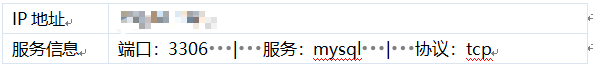

报表成时间：2020-01-01 09:00:00

# 漏洞扫描安全评估报告

# 1.资产概述

## 1.1 资产基本信息

| 资产名称 | 192.1.1.1                                        |
| -------- | ------------------------------------------------ |
| 主机名称 |                                                  |
| 操作系统 | Linux cebos7.4                                   |
| MAC地址  |                                                  |
| 扫描时间 | 2020-01-01 09:00:00-2020-01-01 09:10:00          |
| 漏洞总计 | 0                                                |
| 漏洞分布 | 高风险：0     中风险：0    低风险：0     信息：0 |

## 1.2 资产端口服务分布

| IP地址    | 端口 | 服务         | 协议 |
| --------- | ---- | ------------ | ---- |
| 192.1.1.1 | 7001 | redis_server | tcp  |
| 192.1.1.1 | 7002 | redis_server | tcp  |
| 192.1.1.1 | 8081 | www          | tcp  |

## 1.3 口令猜解信息

| IP地址 | 服务 | 端口 | 用户名 | 密码 |
| ------ | ---- | ---- | ------ | ---- |
|        |      |      |        |      |
|        |      |      |        |      |

# 2.漏洞分布

​			

| 高风险 | 中风险 | 低风险 | 信息 | 总计 |
| ------ | ------ | ------ | ---- | ---- |
| 0      | 0      | 18     | 0    | 0    |

# 

| 漏洞名称统计排名(Top10)                    | 总计 |
| ------------------------------------------ | ---- |
| **服务检测**                               | 4    |
| ***HTTP响应头使用X-XSS-Protection***       | 4    |
| ***HTTP响应头部使用X-Frame-Options***      | 4    |
| ***HTTP相应头X-Content-Options：nosniff*** | 4    |
| ***nginx HTTP服务器检测***                 | 1    |
| ***MySQL服务器检测***                      | 1    |

# 3.漏洞详情

| 漏洞名称   | nginx HTTP服务器检测                                         |
| ---------- | ------------------------------------------------------------ |
| 漏洞分类   | ***Web安全***                                                |
| 漏洞类型   | 系统漏洞                                                     |
| 出现次数   | 1                                                            |
| 风险级别   | 低风险                                                       |
| 概要       | 在远程主机上检测到nginx HTTP服务器                           |
| 描述       | nginx 能够通过查看远程主机上的HTTP标志来检测nginx  HTTP服务器 |
| 解决办法   |                                                              |
| 详情请参阅 | https://nginx.org/                                           |
| 漏洞详情   |                                    |

| 漏洞名称   | MySQL服务器检测                               |
| ---------- | --------------------------------------------- |
| 漏洞分类   | ***Web安全***                                 |
| 漏洞类型   | 系统漏洞                                      |
| 出现次数   | 1                                             |
| 风险级别   | 低风险                                        |
| 概要       | 数据库服务器正在侦听远程端口。                |
| 描述       | 远程主机正在运行MySQL，一个开源数据库服务器。 |
| 解决办法   |                                               |
| 详情请参阅 | https://nginx.org/                            |
| 漏洞详情   |                      |

| 漏洞名称   | 服务检测                                                     |
| ---------- | ------------------------------------------------------------ |
| 漏洞分类   | 服务探测                                                     |
| 漏洞类型   | 系统漏洞                                                     |
| 出现次数   | 4                                                            |
| 风险级别   | 低风险                                                       |
| 概要       | 可以识别远程服务                                             |
| 描述       | 可以通过其Banner来识别远程服务，或者通过查看它在接收到HTTP请求时发送的错误消息 |
| 解决办法   |                                                              |
| 详情请参阅 | https://nginx.org/                                           |
| 漏洞详情   |                                   |

| 漏洞名称   | HTTP响应头使用X-XSS-Protection                               |
| ---------- | ------------------------------------------------------------ |
| 漏洞分类   | ***Web安全***                                                |
| 漏洞类型   | 系统漏洞                                                     |
| 出现次数   | 4                                                            |
| 风险级别   | 低风险                                                       |
| 概要       | 远程Web应用程序不采取措施来减轻一类Web应用程序漏洞。         |
| 描述       | 远程Web应用程序不设置X-XSS-Protection响应头。此标题使最近的Web浏览器中内置的跨站点脚本（XSS）过滤器成为可能。它通常默认情况下是启用的，所以如果用户禁用了这个标头，这个标头的作用是重新启用这个特定网站的过滤器。此标头在IE 8+和Chrome中支持（不确定哪些版本）。在Chrome 4中添加了反XSS筛选器。如果该版本符合此标题，则不详。 |
| 解决办法   | 需要在Web应用程序的所有页面上设置以下相应头：X-XSS-Protection：1; mode=block |
| 详情请参阅 | http://msdn.microsoft.com/en-us/library/dd565647%28v=vs.85%29.aspx |
| CVSS       | CVSS2#AV:N/AC:L/Au:N/C:P/I:N/A:N                             |
| 漏洞详情   |                                   |

| 漏洞名称   | HTTP响应头使用X-Frame-Options                                |
| ---------- | ------------------------------------------------------------ |
| 漏洞分类   | ***Web安全***                                                |
| 漏洞类型   | 系统漏洞                                                     |
| 出现次数   | 4                                                            |
| 风险级别   | 低风险                                                       |
| 概要       | 远程Web应用程序不采取措施来减轻一类Web应用程序漏洞。         |
| 描述       | 远程Web应用程序不设置X-Frame-Options响应头。微软已经提出X-Frame-Options作为缓解点击劫持攻击的一种方法，并且已经在Chrome和Safari中实施。 |
| 解决办法   | 需要在Web应用程序的所有页面上设置以下相应头：X-Frame-Options：DENY |
| 详情请参阅 | http://en.wikipedia.org/wiki/Clickjacking    ：   http://blogs.sans.org/appsecstreetfighter/2009/10/15/adoption-of-x-frame-options-header/CVSS2#AV:N/AC:L/Au:N/C:P/I:N/A:N |
| CVSS       | CVSS2#AV:N/AC:L/Au:N/C:P/I:N/A:N                             |
| 漏洞详情   |                                   |

| 漏洞名称   | HTTP响应头使用X-Content-Options：nosniff                     |
| ---------- | ------------------------------------------------------------ |
| 漏洞分类   | ***Web安全***                                                |
| 漏洞类型   | 系统漏洞                                                     |
| 出现次数   | 4                                                            |
| 风险级别   | 低风险                                                       |
| 概要       | 远程Web应用程序不采取措施来减轻一类Web应用程序漏洞。         |
| 描述       | 远程Web应用程序不设置X-Content-Options响应头。X-Content-Options是Microsoft提出的一种缓解MIME类型攻击的方式，并且已经在Chrome和Safari中实现。 |
| 解决办法   | 需要在Web应用程序的所有页面上设置以下相应头：X-Content-Type-Options：nosniff |
| 详情请参阅 | http://blogs.msdn.com/b/ie/archive/2008/07/02/ie8-security-part-v-comprehensive-protection.aspx |
| CVSS       | CVSS2#AV:N/AC:L/Au:N/C:P/I:N/A:N                             |
| 漏洞详情   |                                   |

# 4.参考标准

## 4.1 单一漏洞风险等级评定标准

| 危险程度 | 危险值区域            | 危险程度说明                                                 |
| -------- | --------------------- | ------------------------------------------------------------ |
| 高       | 7 <= 漏洞风险值 <= 10 | ***攻击者可以远程执行任意命令或者代码，或对系统进行远程拒绝服务攻击。*** |
| 中       | 4 <= 漏洞风险值 < 7   | 攻击者可以远程创建、修改、删除文件或数据，或对普通服务进行拒绝服务攻击。 |
| 低       | 2 <= 漏洞风险值 < 4   | 攻击者可以获取某些系统、服务的信息，或读取系统文件和数据。   |
| 信息     | 0 <= 漏洞风险值 < 2   | 攻击者可以获取服务及组件等版本信息。                         |

| 分值 | 评分标准                                                     |
| ---- | ------------------------------------------------------------ |
| 1    | 可远程获取漏洞组件的版本信息。                               |
| 2    | 目标系统服务器开放了不必要的服务。                           |
| 3    | 可远程访问到某些不在目录树中的文件或读取服务器动态脚本的源码。 |
| 4    | 可远程因为会话管理的问题导致身份冒用。                       |
| 5    | 可远程利用受影响的系统服务器攻击其他浏览网站的用户。         |
| 6    | 可远程读取系统文件或后台数据库。                             |
| 7    | 可远程读写系统文件、操作后台数据库。                         |
| 8    | 可远程以普通用户身份执行命令或进行拒绝服务攻击。             |
| 9    | 可远程以管理用户身份执行命令（受限、不太容易利用）。         |
| 10   | 可远程以管理用户身份执行命令（不受限、容易利用）。           |

## 4.2 联系我们

公司：

网址：

电话：

邮箱：

地址：

