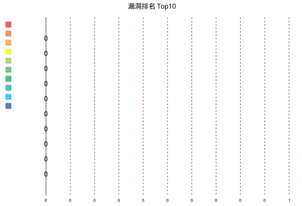

报表成时间：2020-01-01 09:00:00

# 漏洞扫描安全评估报告

# 1.资产概述

## 1.1 资产基本信息

| 资产名称 | 192.1.1.1                                        |
| -------- | ------------------------------------------------ |
| 主机名称 |                                                  |
| 操作系统 | Linux cebos7.4                                   |
| MAC地址  |                                                  |
| 扫描时间 | 2020-01-01 09:00:00-2020-01-01 09:10:00          |
| 漏洞总计 | 0                                                |
| 漏洞分布 | 高风险：0     中风险：0    低风险：0     信息：0 |

## 1.2 资产端口服务分布

| IP地址    | 端口 | 服务         | 协议 |
| --------- | ---- | ------------ | ---- |
| 192.1.1.1 | 7001 | redis_server | tcp  |
| 192.1.1.1 | 7002 | redis_server | tcp  |

## 1.3 口令猜解信息

| IP地址 | 服务 | 端口 | 用户名 | 密码 |
| ------ | ---- | ---- | ------ | ---- |
|        |      |      |        |      |
|        |      |      |        |      |

# 2.漏洞分布

​			

| 高风险 | 中风险 | 低风险 | 信息 | 总计 |
| ------ | ------ | ------ | ---- | ---- |
| 0      | 0      | 0      | 0    | 0    |

# 3.漏洞详情

# 4.参考标准

## 4.1 单一漏洞风险等级评定标准

| 危险程度 | 危险值区域            | 危险程度说明                                                 |
| -------- | --------------------- | ------------------------------------------------------------ |
| 高       | 7 <= 漏洞风险值 <= 10 | ***攻击者可以远程执行任意命令或者代码，或对系统进行远程拒绝服务攻击。*** |
| 中       | 4 <= 漏洞风险值 < 7   | 攻击者可以远程创建、修改、删除文件或数据，或对普通服务进行拒绝服务攻击。 |
| 低       | 2 <= 漏洞风险值 < 4   | 攻击者可以获取某些系统、服务的信息，或读取系统文件和数据。   |
| 信息     | 0 <= 漏洞风险值 < 2   | 攻击者可以获取服务及组件等版本信息。                         |

| 分值 | 评分标准                                                     |
| ---- | ------------------------------------------------------------ |
| 1    | 可远程获取漏洞组件的版本信息。                               |
| 2    | 目标系统服务器开放了不必要的服务。                           |
| 3    | 可远程访问到某些不在目录树中的文件或读取服务器动态脚本的源码。 |
| 4    | 可远程因为会话管理的问题导致身份冒用。                       |
| 5    | 可远程利用受影响的系统服务器攻击其他浏览网站的用户。         |
| 6    | 可远程读取系统文件或后台数据库。                             |
| 7    | 可远程读写系统文件、操作后台数据库。                         |
| 8    | 可远程以普通用户身份执行命令或进行拒绝服务攻击。             |
| 9    | 可远程以管理用户身份执行命令（受限、不太容易利用）。         |
| 10   | 可远程以管理用户身份执行命令（不受限、容易利用）。           |

## 4.2 联系我们

公司：

网址：

电话：

邮箱：

地址：

