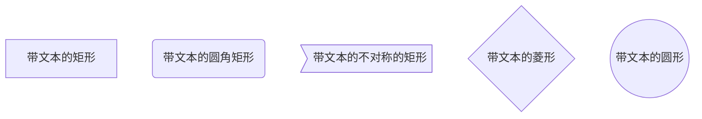

### demo

```
#### 流程图方向
* TB 从上到下
* BT 从下到上
* RL 从右到左
* LR 从左到右
* TD 同TB

##### 示例
>>从上到下
​```mermaid
graph TD
 A --> B
​```

>> 从左到右
​```mermaid
graph LR
    A --> B
​```
```


### 基本图形



 

### 节点之间的连接

```
A --> B A带箭头指向B
A --- B A不带箭头指向B
A -.- B A用虚线指向B
A -.-> B A用带箭头的虚线指向B
A ==> B A用加粗的箭头指向B
A -- 描述 --- B A不带箭头指向B并在中间加上文字描述
A -- 描述 --> B A带箭头指向B并在中间加上文字描述
A -. 描述 .-> B A用带箭头的虚线指向B并在中间加上文字描述
A == 描述 ==> B A用加粗的箭头指向B并在中间加上文字描述
```


### 子流程图

 格式

```
subgraph title
    graph definition
end
```

示例

```
​```mermaid
graph TB
    c1-->a2
    subgraph one
    a1-->a2
    end
    subgraph two
    b1-->b2
    end
    subgraph three
    c1-->c2
    end
​```
```


### 自定义样式

```
​```mermaid
graph LR
    id1(Start)-->id2(Stop)
    style id1 fill:#f9f,stroke:#333,stroke-width:4px,fill-opacity:0.5
    style id2 fill:#ccf,stroke:#f66,stroke-width:2px,stroke-dasharray: 10,5
​```
```


### demo

绘制一个流程图,找出 A、 B、 C 三个数中最大的一个数。

```
​```mermaid
graph LR
    start[开始] --> input[输入A,B,C]
    input --> conditionA{A是否大于B}
    conditionA -- YES --> conditionC{A是否大于C}
    conditionA -- NO --> conditionB{B是否大于C}
    conditionC -- YES --> printA[输出A]
    conditionC -- NO --> printC[输出C]
    conditionB -- YES --> printB[输出B]
    conditionB -- NO --> printC[输出C]
    printA --> stop[结束]
    printC --> stop
    printB --> stop
​```
```


 

 

参考地址：

https://www.jianshu.com/p/b421cc723da5

https://blog.csdn.net/liuxiao723846/article/details/83544588